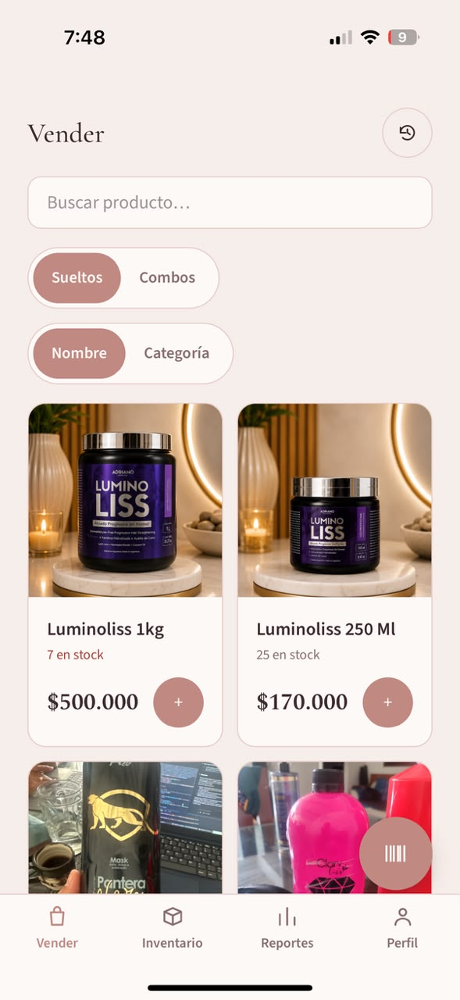
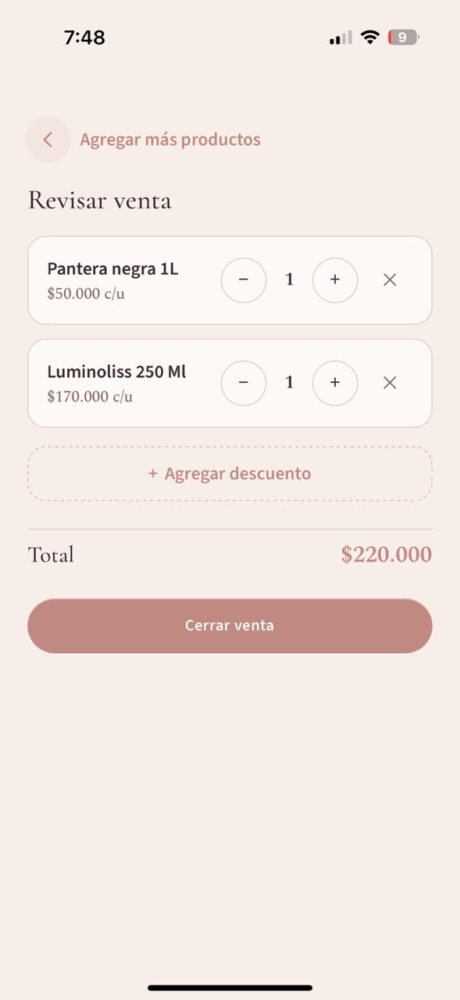
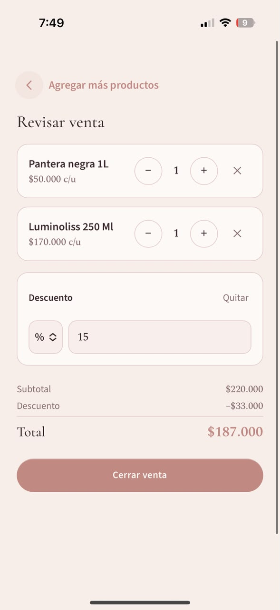
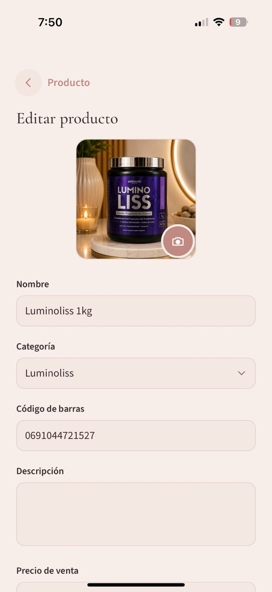
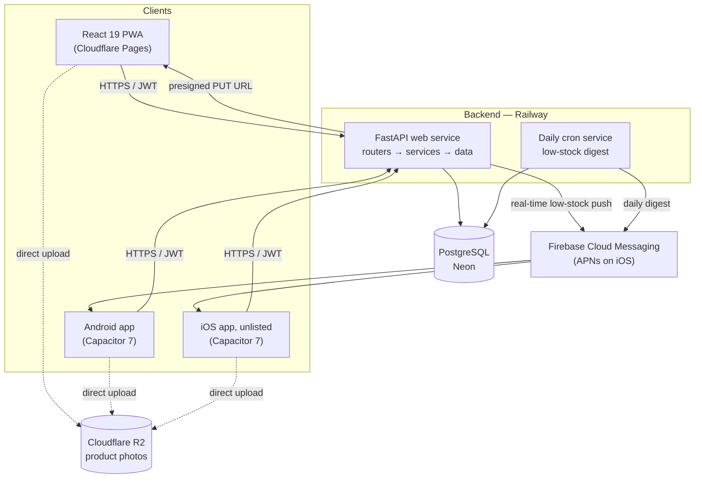

# Salon Inventory & Sales Platform — Case Study

> An inventory, point-of-sale and reporting system for a hair straightening salon in Colombia, taken from zero software to a PWA plus native Android and iOS apps. Built solo as a freelance project.


**Client:** Anyeli Sanguino, hair straightening salon (Colombia) — named with permission
**Landing:** [anyelisanguino.com](https://anyelisanguino.com)
**Source code:** private (client-owned repository). This repo holds only the case study.

---

## What is it?

The salon ran without any software: no inventory count, no record of what each sale actually earned, no way to tell retail stock from product used during treatments. The platform gives the owner a phone-first cash register (search or scan a barcode, build a cart, apply a discount, close the sale), an inventory that knows its own cost, and reports that split every sale into **profit vs. reinvestment**.

It is in daily use at the salon, with 11 products in inventory and 10 sales bundles (combos) configured by the owner herself.

The technical challenge was less about scale and more about **correctness of money and stock**: weighted-average costing, prices frozen at sale time, voids that return stock without corrupting cost, bundles that expand into components inside one transaction, and concurrent writers that must never deadlock or oversell — all on top of a mobile app shipped to both Android and iOS.

| Point of sale | Cart review | Discount | Product edit |
|---|---|---|---|
|  |  |  |  |

---

## Discovery & Requirements

The owner is not technical and had never used business software, so requirements could not be collected as a spec. The process was:

1. **Informal conversations → a first guess.** A draft of the idea was built from early conversations before any formal meeting.
2. **A requirements meeting with the owner** to land scope, trade-offs and growth paths. Her needs came out as stories, e.g. *"when I sell something, I want to know how much is profit and how much goes back into stock"*, *"some products are sold, some are only applied in treatments, some are both"*, *"I import a box and add shipping to the country and to the city."*
3. **A written PRD (v0.2, 2026-07-22)** that turned those stories into **explicit business decisions**, each one recorded with its rationale so it could be revisited with the client:

| Business question | Decision in the PRD |
|---|---|
| How is inventory valued? | **Weighted average cost**, recalculated on every stock entry (FIFO explicitly deferred — it would require a lots table). |
| How is money stored? | `Numeric(14,4)` in the database, displayed as whole Colombian pesos. Never floats. |
| What is the truth for stock? | An **append-only movements ledger**. `productos.stock` is a denormalized cache updated in the same transaction and reconcilable against the ledger. |
| Do price changes affect past sales? | No. Sale price and unit cost are **frozen on each sale line**. |
| How is a sale undone? | **Voiding** marks the sale and writes a reverse movement that returns stock. It deliberately does **not** revert average cost (purchases may have happened in between). |
| Retail vs. treatment products? | Two independent flags, `es_vendible` (sellable) and `es_aplicable` (used in treatments), covering all combinations. Treatment use is an `internal consumption` movement, not a sale. |
| Discounts? | Per sale, by percentage or fixed amount. Profit is computed on the discounted total. |
| Import costs? | The owner computes the landed unit cost (base price + country freight + city freight); the app stores the breakdown as informational metadata and costs with the final figure. |
| Repackaging? | A source product is split into N units of a destination product; its cost transfers proportionally (plus an optional per-unit container cost). |

The PRD also drew hard **out-of-scope** lines (multi-branch, differentiated roles, electronic invoicing) and split delivery into phases: **Phase 1** (MVP PWA), **Phase 1.5** (repackaging), **Phase 2** (native apps + push), with the customer CRM / WhatsApp reminders kept for later.

Combos were not in the original PRD: they appeared during real use (the owner kept selling the same 2–3 products together) and went through the same spec → design → tasks cycle before any code.

---

## System Architecture



Two environments (**develop** and **production**), each with its own Railway service, Neon database and R2 bucket, behind custom domains on Cloudflare (`app.anyelisanguino.com` for the PWA). Locally, Docker Compose runs two Postgres instances: one for development, one disposable for integration tests.

### Backend layers

A **pragmatic layered architecture**, not full Clean Architecture — a conscious choice for a single-business app maintained by one developer.

| Layer | Directory | Responsibility |
|---|---|---|
| **API** | `app/api/` | Thin routers per domain (auth, products, categories, combos, inventory, sales, reports, uploads, push). Receive, delegate, respond. No business logic. |
| **Services** | `app/services/` | All business rules: weighted cost, sale creation and voiding, combo expansion, repackaging, discount proration, reports, push composition. |
| **Database** | `app/database/` | SQLModel tables and session. Value domains are `CHECK` constraints, money is `Numeric(14,4)`. |
| **Models** | `app/models/` | Pydantic request/response schemas, kept separate from tables. |
| **Core** | `app/core/` | Settings, security (JWT, Argon2), rate limiting, logging, FCM client, domain exceptions. |
| **Jobs** | `app/jobs/` | The daily job run by the Railway cron service. |

---

## Tech Stack — With Rationale

| Technology | Why |
|---|---|
| **FastAPI + SQLModel + Pydantic** | Already mastered and fast to deliver with; SQLModel tables kept separate from I/O schemas. |
| **PostgreSQL (Neon)** | Row-level locks (`SELECT … FOR UPDATE`), partial unique indexes and `CHECK` constraints are part of the correctness story. Neon's free tier covers a single salon's data. |
| **Alembic** | Versioned migrations, including data migrations (e.g. barcode normalization). |
| **uv** | Dependency management and reproducible lockfile. |
| **pytest against real Postgres** | Tests run against a Postgres container, **not SQLite**, because the behavior under test (`FOR UPDATE`, partial constraints) only exists in Postgres. ~385 backend test functions. |
| **ruff** | Lint + format, with annotations (`ANN`) and bandit (`S`) rules enabled. |
| **React 19 + TypeScript + Vite** | Mobile-first SPA, installable as a PWA (`vite-plugin-pwa`). |
| **TanStack Query / Zustand / Zod** | Server cache, small client state (auth, cart), input validation. |
| **Tailwind CSS 4** | Fast iteration on a custom, salon-branded visual design. |
| **@zxing/browser** | Barcode scanning from the camera inside the WebView, same code on web, Android and iOS. |
| **Capacitor 7** | One codebase wrapped as native Android and iOS apps; native secure storage and push. |
| **Firebase Cloud Messaging** | One push API for both platforms (FCM bridges to APNs on iOS). |
| **Cloudflare Pages + R2** | Free static hosting for the PWA; S3-compatible object storage with free egress for product photos. |
| **Railway** | Always-on API plus a second cron service from the same repo. |
| **Astro** | Static, fast landing page (see below). |

---

## Key Engineering Decisions

### Stock as a cache, movements as the source of truth

Every stock change (entry, sale, internal consumption, manual adjustment, void, repackaging out/in) writes a signed row to `inventario_movimientos` **and** updates `productos.stock` in the same transaction. A database `CHECK` prevents negative stock, and the service raises a domain error before that constraint is ever reached. Tests assert that `stock == SUM(movements)` after every kind of operation, including concurrent ones.

### Weighted average cost, in `Decimal` end to end

```
new_avg = (stock × current_avg + qty × landed_unit_cost) / (stock + qty)
```

Computed with `Decimal`, quantized once at the end to 4 decimals. The first entry needs no special case (with `stock = 0` the formula reduces to the entry cost). Sales copy the current average into the sale line, so profit reports never depend on today's cost.

### Deadlock-free locking with a global lock order

A multi-product cart locks several product rows. Instead of one `WHERE id IN (…) FOR UPDATE` (Postgres does not guarantee lock acquisition order), each row is locked **one statement at a time in ascending UUID order**, and every writer in the system follows that same order. Voids lock the sale header first, then products in the same order, and check the sale state **after** acquiring the lock, so two concurrent voids of the same sale cannot both succeed. Concurrency tests use two real connections, an event-gated delay anchored on the shared row, and a short `lock_timeout` so a deadlock fails fast instead of hanging the suite.

### Atomic sale: validate everything, then mutate

Duplicate cart lines are merged before locking; every line is validated (sellable, not archived, enough stock) before anything is written; then header, lines with frozen price and cost, ledger movements and stock decrements are committed once.

### Combos as derived products

A combo is a product flagged `es_combo` with 2–5 components and an optional combo discount. It has **no stock or cost of its own**: available quantity is `min(floor(component_stock / component_qty))`, and its price is derived from components. When sold, the combo is **expanded server-side into component lines inside the same atomic transaction**, so inventory, cost and reports stay per real product. Combos are rejected as targets of stock entries or adjustments.

### Exact discount proration

Sale and combo discounts are distributed across lines with a shared pure function: the first N−1 shares are rounded, the last one absorbs the residual, so the parts always sum exactly to the discount. It was extracted into one module instead of keeping two independently rounded copies.

### Repackaging (Phase 1.5)

One transaction, two movements: an outflow on the source product (its average cost untouched, like a sale) and an inflow on the destination whose unit cost is the transferred source cost plus an optional container cost, folded into the destination's weighted average. Built, then tested in real use by the owner before merging.

### Reports in the business time zone

Data is stored in UTC, but the salon operates in Colombia (UTC−5); an 8:30 pm sale is "tomorrow" in UTC. Reports bucket with `date_trunc(…, created_at AT TIME ZONE 'America/Bogota')` and convert date filters once into a half-open UTC interval.

### Spec-driven development

Each domain (data model, auth, products, inventory, sales, reports, combos, push, Capacitor setup, repackaging…) went through its own small cycle: proposal → spec → design → tasks → tests → implementation → verification against the spec. Small cycles surfaced inconsistencies early instead of at the end.

---

## Mobile: PWA → Android & iOS with Capacitor

The app started as a PWA and was wrapped with Capacitor in three slices: (1) web shell — secure storage, service worker, icons; (2) native Android project, permissions, signing, tested on a real phone over USB; (3) native iOS project.

- **Android:** signed release build installed and tested on a real device; the hardware back button navigates instead of closing the app.
- **iOS:** built with Xcode (on borrowed Macs, without owning one) and distributed as an **unlisted App Store app** — reachable only by direct link, not searchable.
- **Push (FCM) on both platforms:** a real-time alert whenever any stock-decreasing operation (sale, internal consumption, negative adjustment, repackaging source) crosses a product's minimum — sent post-commit, best-effort, so an FCM failure never affects the operation — plus a daily digest from a Railway cron job listing products below minimum, ordered by urgency. Device tokens are upserted per device because FCM tokens rotate and a device can change user.
- **App Review without exposing real data:** the app is single-tenant — products and inventory are global, so a reviewer account against production could alter real stock (and a void does not revert average cost). The demo account is routed to the **develop** backend at login; the routing only exists when the build defines the demo variables, and a unit test covers that no other user can be diverted.
- **Secure storage:** on native, the refresh token lives in encrypted secure storage, not plain preferences.

---

## Landing page

[anyelisanguino.com](https://anyelisanguino.com) is a static **Astro** site in Spanish (es-CO), deployed on Cloudflare Pages. It presents the salon's services, the products it sells with their public prices, and a privacy policy page. Services are intentionally shown without a price list, because they are quoted per client (hair length and density). Iteration focused on mobile rendering details (hero image sharpness, viewport resizing when the browser bar collapses, active-section navigation).

---

## WhatsApp Business API automation

Separate from the app, the salon's customer chat runs on the **WhatsApp Business API through a BSP (Wati)**. I designed a rule-based automation that answers the repetitive questions (prices of products, location, opening hours) and **hands the chat to the owner only at three moments: booking, buying, or a complaint/risk signal**. Human handoff relies on the platform's native lock (a chat assigned to a person pauses automations), and informational replies use session messages instead of templates to avoid per-template charges. Business facts (services, policies, catalog) live in one versioned knowledge base that the bot and the landing both consume. Moving off the current provider is being evaluated.

---

## Infrastructure & Deployment

```
feature branch ──PR──► develop ──PR──► main
                      (develop env)    (production)
```

| Piece | Where |
|---|---|
| PWA | Cloudflare Pages (production + preview for `develop`) |
| API | Railway web service, one per environment |
| Daily job | Second Railway service (cron) sharing the project variables |
| Database | Neon Postgres, one per environment |
| Photos | Cloudflare R2, one bucket per environment, uploaded via presigned PUT |
| DNS / domains | Cloudflare, custom subdomains per environment |
| Mobile builds | Built locally: Android Studio / Gradle for Android, Xcode for iOS |

There is no public sign-up: users are created through a CLI command (`crear-usuario`) that reads the password from an interactive prompt or an environment variable — never a command-line flag, which would leak into shell history and process lists.

---

## Security Decisions

- **Short-lived access token + long-lived refresh token** stored server-side with an opaque `jti`, so sessions can be revoked.
- **Uniform login failures:** unknown user, wrong password and inactive user are indistinguishable to the caller.
- **Argon2** password hashing (`pwdlib`).
- **Login rate limiting** per IP + username. Uvicorn is configured to honor `X-Forwarded-For` from Railway's edge; otherwise every client would share Railway's internal IP and anyone could lock out a known username.
- **CORS without wildcards**, per environment, on both the API and the R2 buckets (they are configured separately — the upload goes browser → R2 directly).
- **HTTP security headers** on every response (`X-Frame-Options: DENY`, HSTS, among others).
- **Uploads:** presigned URLs with a signed content type and a 5 MB size limit.
- **Fail-fast settings:** outside local/test, the app refuses to start with a weak or placeholder `SECRET_KEY`.
- **Secrets only in environment variables** — the Firebase service account lives in Railway shared variables, never in the repo.

---

## Solved Production Problems

### Barcode scanner froze on real Android and iOS devices

**Problem:** The camera opened for an instant and then stopped with "could not read the code."
**Root cause:** Three compounding issues. (1) On mobile, `play()` resolves before video metadata, so ZXing sized its capture canvas at 0×0 and every frame threw. (2) Blurry frames raise `ChecksumException`/`FormatException`, which are normal while scanning, but only `NotFoundException` was being ignored. (3) The ignore list compared exception **names**, and the production build minified class names — `NotFoundException` became `t` — so it never matched.
**Fix:** Open the stream ourselves with the rear camera and wait for `loadedmetadata`; treat all per-frame decode exceptions as non-fatal; compare with `instanceof` against the imported classes. Also request 1080p and continuous autofocus so small or curved barcodes (bottles) resolve. Confirmed by inspecting the real production bundle.

### The same product scanned as two different codes

**Problem:** A product created from one scan was not found when scanned again.
**Root cause:** ZXing decodes the same physical code as UPC-A (12 digits) or EAN-13 (13 digits, leading zero) depending on the frame; the backend compared strings exactly.
**Fix:** One shared validator on create, update and search that normalizes 12-digit numeric codes to EAN-13, plus a data migration for existing products.

### Photo upload failed silently on Android

**Problem:** After picking a photo, nothing happened: no request, no exception, no log.
**Root cause:** Android's Photo Picker returns a `File` backed by a `content://` URI with a transient read permission, which expired during the round trip to get the presigned URL.
**Fix:** Read the bytes into an `ArrayBuffer` immediately, before any `await`. Diagnosed by remote-inspecting the WebView on the physical device.

### iOS push: devices registered, notifications never arrived

**Problem:** Push worked on Android but not iOS.
**Root cause:** `AppDelegate` lacked the remote-notification overrides that Capacitor documents but does not generate; and the push plugin returned a **raw APNs token** on iOS (only Android gets FCM tokens for free via Play Services), which the backend's FCM client rejected — silently, because only "invalid token" errors were logged.
**Fix:** Added the overrides, switched both platforms to `@capacitor-firebase/messaging` to obtain real FCM tokens, retried `getToken()` with short backoff for the asynchronous APNs registration, and logged every failed send. That logging is what exposed the last blocker: a new APNs key that simply needed time to propagate in Firebase.

### Discount and fan-out bugs in reports (caught before release)

**Problem:** A first version of per-product profit used the stored discount **input** (e.g. `10` for 10%) as if it were an amount, and a direct `JOIN` with sale lines multiplied a sale's total by its number of lines.
**Fix:** The applied discount is reconstructed as `subtotal − total` (both already quantized), and sale lines are aggregated in a subquery before joining 1:1. Both tests were verified by reintroducing the bug and watching them fail.

### iOS build issues

Xcode 26 refused to build pods targeting iOS 14 (Capacitor's helper only raises targets below 14), fixed with a `Podfile` `post_install` forcing 15.0. Content collided with the notch because `env(safe-area-inset-*)` resolves to 0 without `viewport-fit=cover`. And a build-time `VITE_API_URL` baked the wrong backend into an uploaded build, so grepping the built bundle for the expected API URL is now a mandatory step before archiving.

---

## What I'd Do Differently

**Add CI from day one.** Tests, lint and type checks run locally and in the spec-driven cycle, but there is no CI pipeline gating merges. With two long-lived branches and native builds, an automated check on every PR would have caught the `main`/`develop` divergence I later found after a manual revert and re-merge.

**Run migrations as part of the deploy.** Railway starts the API directly, and `alembic upgrade head` is a manual step after deploys that change the schema. It is documented, but it is exactly the kind of step that gets forgotten; a release command or pre-deploy hook should own it.

**Move the login rate limiter out of process memory.** It is a deliberate shortcut — fine for a single Railway instance, but it resets on restart and would not be shared across replicas. A shared store (Redis or a Postgres table) is the upgrade path.

**Ask "what can the App Store reviewer see?" before the first build, not at archive time.** The demo-account routing worked, but it was designed late. For any single-tenant app it belongs in the initial design.

---

## Timeline

| Date | Milestone |
|---|---|
| 2026-07-22 | Requirements meeting and PRD v0.2 |
| 2026-08-04 → 08-11 | Data model, auth, products, inventory, sales, reports; PWA frontend |
| 2026-08-27 → 08-28 | Combos; Phase 1 MVP released to production; repackaging (Phase 1.5); scanner fixes; Capacitor Android |
| 2026-08-29 → 09-17 | Real-time and daily push, Android hardening, security pass |
| 2026-09-19 → 09-29 | iOS build with Xcode, FCM/APNs on iOS, unlisted distribution |
| Ongoing | WhatsApp provider migration, Play Store publication |

---

## Author

**Elian Camilo Angarita**
- LinkedIn: [linkedin.com/in/elian-camilo-angarita](https://linkedin.com/in/elian-camilo-angarita)
- GitHub: [github.com/elian-camilo](https://github.com/elian-camilo)
- Email: ec.angaritas@gmail.com
